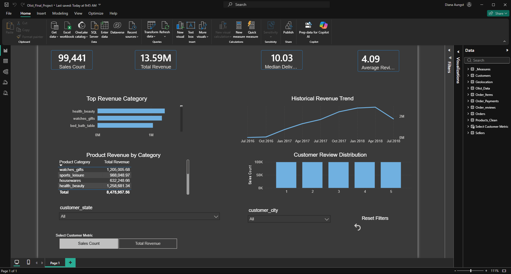

# Olist E-Commerce Executive Analytics Dashboard

## Project Overview
An executive-level data analytics framework engineered using a Star Schema data architecture to analyze Brazilian e-commerce operations. This system unifies dynamic filtering and user-interactive parameters to deliver immediate operational clarity.

## Key Visualizations & Framework Milestones
- **Dynamic Metric Slicer:** Implemented via Field Parameters allowing executives to toggle the customer satisfaction visual natively between Count and Revenue metrics.
- **Trend Analysis:** Custom chronological line charts tracking historical revenue volume and pinpointing seasonal events (such as the Black Friday spike).
- **Advanced Navigation:** Configured Page Drill-Through infrastructure to pass product category filters automatically to deep-dive reports.

## Getting Started
1. Open `Olist_Final_Project.pbix` in Power BI Desktop.
2. Interact with the bottom tiles to toggle dashboard metrics dynamically.
3. Right-click product categories to drill down into localized performance metrics.